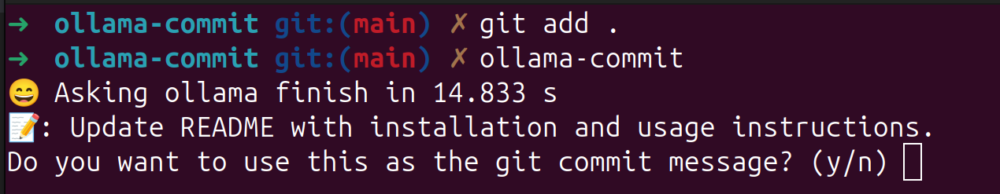

# ollama-commit

use [ollama](https://ollama.com/) to generate commit message

# before all

1. install [ollama](https://ollama.com/) in your mac or pc.
2. pull [llama3.1](https://ollama.com/library/llama3.1) first:

```bash
ollama pull llama3.1:latest
```

# feature

- use `ollama` to generate commit message
- no api key required, use local LLM model
  
# install

```bash
npm i -g @miaos/ollama-commit
```

# usage

1. edit some files in your project
2. use `git add` to add some changes
3. run `ollama-commit` in the root of your project



# api

commit prefix with emoji

```bash
useEmoji=true ollama-commit
```

# commit style

commit style follow [Semantic Commit Messages](https://gist.github.com/brianclements/841ea7bffdb01346392c) style.